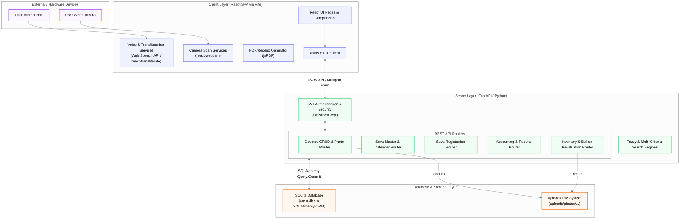
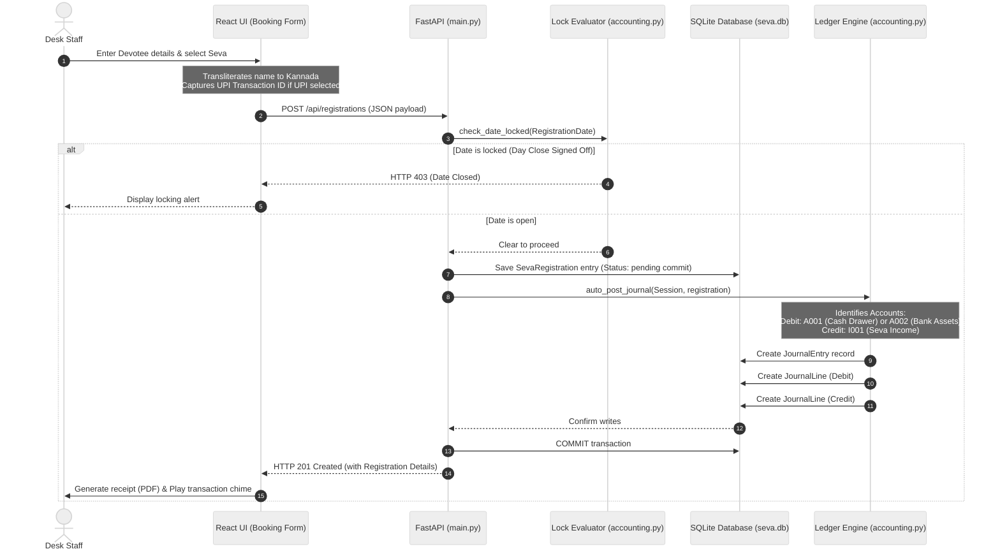
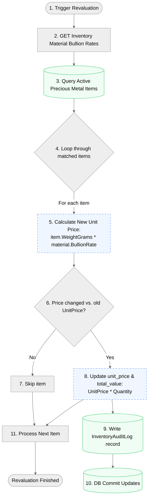
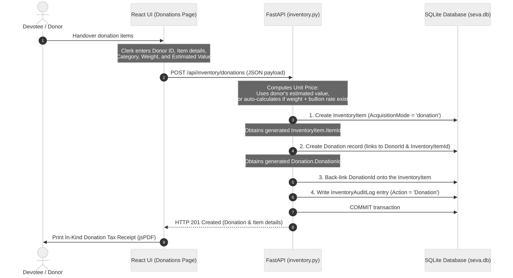

# SRS Seva — System Architecture & Data Flow

This document details the modular client-server architecture of the modernized SRS Seva Intranet application. It maps out the layers, components, database schemas, and transactional data flows.

> [!TIP]
> **How to Zoom / Read the Diagrams:**
> - **In VS Code/IDE Markdown Preview:** Press `Ctrl` + `+` (Windows/Linux) or `Cmd` + `+` (macOS) to zoom in the entire preview pane. Press `Ctrl` + `-` or `Cmd` + `-` to zoom back out.
> - **Open in Browser:** Drag-and-drop this markdown file into a modern markdown editor/viewer or export it as HTML to zoom natively in your browser.
> - **Interactive View & High-Res Export:** Copy any of the `mermaid` code blocks below and paste them into the [Mermaid Live Editor](https://mermaid.live). It provides pan, zoom, and exports to SVG or PNG.

---

## 1. High-Level Architecture Layers

The system is structured as a classical **three-tier client-server architecture** with local file storage:



---

## 2. Component Directory Structure & Mapping

| Component Layer | Directory / File Path | Purpose & Responsibilities | Key Technologies |
| :--- | :--- | :--- | :--- |
| **Frontend UI** | [frontend/src](file:///home/mohana/.gemini/antigravity/scratch/SRS-Seva/frontend/src) | Single Page Application entry, styling system, and routing context. | React, TypeScript, Tailwind CSS, Vite |
| **Frontend Pages** | [frontend/src/pages](file:///home/mohana/.gemini/antigravity/scratch/SRS-Seva/frontend/src/pages) | Domain dashboards (Booking, Seva Calendar, Customers, Accounting, Assets/Consumables, Settings). | react-router-dom, Framer Motion |
| **Frontend Hardware** | [frontend/src/components](file:///home/mohana/.gemini/antigravity/scratch/SRS-Seva/frontend/src/components) | Modals and inputs for camera scan, audio alerts, voice/Kannada transliteration, and receipt rendering. | react-webcam, react-transliterate, jsPDF |
| **Backend API** | [backend/app/api](file:///home/mohana/.gemini/antigravity/scratch/SRS-Seva/backend/app/api) | Controller endpoints for Accounting, Inventory, Image synchronization, and system configuration. | FastAPI APIRouter |
| **Backend Core** | [backend/app/core](file:///home/mohana/.gemini/antigravity/scratch/SRS-Seva/backend/app/core) | Central config, JWT utility handlers, and password hashing algorithms. | Passlib (BCrypt), python-jose |
| **Data Models** | [backend/app/models](file:///home/mohana/.gemini/antigravity/scratch/SRS-Seva/backend/app/models) | SQLAlchemy class definitions mapped to SQLite relational tables. | SQLAlchemy |
| **Data Schema** | [backend/app/schemas](file:///home/mohana/.gemini/antigravity/scratch/SRS-Seva/backend/app/schemas) | Pydantic data models for request validation and response filtering. | Pydantic v2 |

---

## 3. Detailed Data Flow Diagrams

### Flow A: Seva Booking & Real-Time Double-Entry Accounting Post

When a staff member registers a devotee for an offering (Seva), the transaction is validated against calendar/close-day locks and immediately synced to double-entry ledger books:



---

### Flow B: Precious Metal (Bullion) Asset Revaluation Flow

Bullion-based asset values automatically adjust to market fluctuations. When a bullion rate updates, a revaluation engine recalculates the asset book values and creates a system audit trail:



---

### Flow C: Devotee In-Kind Donation Flow

Devotees can donate physical assets (e.g., gold ornaments, vehicles) or consumables (e.g., grocery provisions). This flow ensures that a physical donation simultaneously creates a donor history and adds the item to the inventory catalog:



---

## 4. Database Schema Structure & Key Relations

The SQLite database `seva.db` maps entities across relational tables to maintain clean history:

```mermaid
%%{init: {'theme': 'neutral', 'themeVariables': { 'fontSize': '18px', 'fontFamily': 'Inter, sans-serif' }}}%%
erDiagram
    %% Devotee Master
    Devotee {
        int DevoteeId PK
        string Name
        string Phone
        string WhatsApp_Phone
        string Email
        string Gotra
        string Nakshatra
        text Address
        string City
        string PinCode
        string PhotoPath
        boolean IsDeleted
    }

    %% Seva Master
    Seva {
        string SevaCode PK
        string Description
        string DescriptionEn
        float Amount
        int TPQty
        int PrasadaAddonLimit
        boolean IsSpecialEvent
        string EventDate
        string RecurrenceRule
    }

    %% Composite Sevas linking table
    EventComposition {
        int Id PK
        string ParentEventCode FK
        string ChildSevaCode FK
    }

    %% Seva Registrations
    SevaRegistration {
        int RegistrationId PK
        string RegistrationDate
        string SevaDate
        int DevoteeId FK
        string SevaCode FK
        int Qty
        float Rate
        float Amount
        boolean OptTheerthaPrasada
        int PrasadaCount
        string PaymentMode
        string PaymentReference
        json PaymentDetails
        float GrandTotal
        boolean IsFulfilled
    }

    %% Double-Entry Accounting Tables
    AccountHead {
        int Id PK
        string Code
        string Name
        string Type
        int ParentId FK
        boolean IsActive
    }

    JournalEntry {
        int Id PK
        string EntryDate
        text Narration
        string SourceModule
        string SourceRefId
    }

    JournalLine {
        int Id PK
        int JournalEntryId FK
        int AccountId FK
        float Debit
        float Credit
    }

    BankAccount {
        int Id PK
        string AccountName
        string BankName
        string AccountNumber
        float CurrentBalance
    }

    BankTransaction {
        int Id PK
        int BankAccountId FK
        string TransactionDate
        string Type
        string Mode
        float Amount
        string Reference
        boolean IsReconciled
        string Status
        int JournalEntryId FK
    }

    ClosedDay {
        string Date PK
        datetime ClosedAt
    }

    %% Inventory Master Tables
    InventoryItem {
        int ItemId PK
        string Name
        string Description
        string Category
        string ItemType
        string UOM
        string Material
        float WeightGrams
        float UnitPrice
        int Quantity
        float TotalValue
        string AcquisitionMode
        int DonorId FK
        int DonationId FK
    }

    Donation {
        int DonationId PK
        int DonorId FK
        string DonationDate
        string VoucherNo
        string ItemName
        float EstimatedValue
        int InventoryItemId FK
    }

    %% Relations
    Devotee ||--o{ SevaRegistration : "registers for"
    Seva ||--o{ SevaRegistration : "is booked in"
    Seva ||--o{ EventComposition : "composes / child of"
    
    JournalEntry ||--|{ JournalLine : "contains"
    AccountHead ||--o{ JournalLine : "posted to"
    
    BankAccount ||--o{ BankTransaction : "holds"
    JournalEntry ||--o? BankTransaction : "reconciles"

    Devotee ||--o{ Donation : "donates"
    Donation ||--|| InventoryItem : "creates"
```

> [!NOTE]
> The database schemas maintain legacy tables (`Customer`, `Item`, `Invoice_Hdr`, `Invoice_Dtl`) in read-only status for auditing and historical compatibility. Any new transactions occur strictly within the modernized tables (`Devotee`, `Seva`, `SevaRegistration`, `InventoryItem`, etc.).
